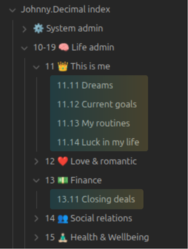

# Obsidian Johnny Decimal Plugin
**Automatically manage your Johnny.Decimal prefixes so you can focus on writing, not numbering.**

Johnny Decimal Plugin is designed to automate the maintenance of the Johnny Decimal system. It ensures your file structure remains consistent by automatically handling the numbering and naming conventions of your files and folders.

## ✨ Features
- **Auto-Prefixing:** Automatically detects the next available index in a category and applies it when folder/file is moved to that catergory.
- **Smart Renaming:** Renaming a folder updates the prefix to ensure it matches the parent directory's hierarchy.
- **Consistency Checks:** Prefix updates are propagated down the folder tree to ensure all folders/files have a correct prefix.
- **Flexibility:** Manual name changes by user allow for almost anything, not to restrain your creativity.
- **Error Proofing:** Does not allow for duplicated prefixes - reverts name change for conflicted folders.

⠀
## 🚀 How It Works
This plugin operates on the logic of the [Johnny Decimal System](https://johnnydecimal.com/).
1. **Move a folder:** When you move a folder inside JD index (parent folder has a prefix), the plugin automatically assigns it the next available prefix.
2. **Rename:** If you change a folder prefix i.e. from 11 to 12, the change is propagated to all subfolders and their prefixes are updated accordingly.

⠀
## ⚙️ Installation
<!-- ### Via Community Plugins (Preferred)
1. Open Settings > Community Plugins in Obsidian.
2. Turn off Safe Mode.
3. Click Browse and search for "[Your Plugin Name]".
4. Click Install and then Enable. -->

### Manual Installation
1. Download the **main.js** and **manifest.json** from the [Latest Release](https://github.com/pwaclawiak/johnny-decimal-plugin-obsidian/releases/latest).
2. Navigate to your vault folder: **.obsidian/plugins/**.
3. Create a folder named **johnny-decimal-plugin**.
4. Paste the downloaded files into that folder.
5. Reload Obsidian and enable the plugin.

⠀
## 🛠️ Settings
You can customize the behavior in Settings > Johnny Decimal Plugin:

Depending on granularity of divisions that you want, and number of files you add to your vault,
you may choose to use the original Johnny.Decimal approach or try my own flavor that I use in Obsidian,
which I call *flattened* version (for no better idea so far).

In this "flattened" version, the IDs (prefixes, such as 14.21) are assigned to **files**
instead of **folders**.

It works fine for me as I usually prefer to store related ideas in a single file instead of scattered
between several files in a folder.

**Here is the comparison of these two types of structure:**
<table>
  <tr>
    <th> Standard </th>
    <th> Flattened </th>
  </tr>
  <tr>
    <td>  </td>
    <td>  </td>
  </tr>
</table>

⠀
## 🎯 Roadmap
The plugin is usable in its current form, but there are more features and ideas to implement in the future:
- [ ] **Assign prefix on folder/file creation** (only inside JD structure)
- [ ] Add a command to remove prefixes from folder's children
- [ ] Add command that adds new shelf level/category level folder to JDex (needs to store jdex location in settings)
- [ ] Add a command to auto number files/folders based on parent prefix (with a pop-up to confirm)
- [ ] Setting to block (manually) adding prefixes in levels > 2
- [ ] Renaming (scheduled by parent) flattened folders at first 10 indexes maps them to regular index range on parent
- [ ] Add command for renaming subfolders of selected folder to put them in the first 10 indexes of flattened mode (if there is <= 10 folders in total, otherwise show message in notice)
- [ ] Support for JD-Head-Folder that stores the level_0-prefixed folders to be able to automatically assign level_0 prefixes inside it
- [ ] Add support for moving multiple files/folders at once (by shift+clicking) (currently only one is processed because queue is blocked for all)
- [ ] Change the JDFile class and functions in utils.ts not to use obsidian API to be able to run unit tests
- [ ] Add vivual effect (highlight file/folder with a color that fades over 1 second) upon renaming by the plugin

⠀
## ⚠️ Important Note
**Please make sure to backup your vault before using the plugin!**

While this plugin has been tested, it performs file renaming operations,
and in specific system conditions might act unpredictably.

It will never delete your files but may change their names in a way you do not like
and that is tideous to reverse for big number of files.

We recommend having a backup solution (like Obsidian Sync, Git, or regular backups) in place before running automated organization tools on your entire vault.

⠀
## 🤝 Contributing
Contributions are welcome! If you have an idea for a feature or a fix:
1. Fork the github [repository](https://github.com/pwaclawiak/johnny-decimal-plugin-obsidian).
2. Create a new branch (git checkout -b feature/your-feature).
3. Commit your changes.
4. Push to the branch.
5. Open a Pull Request.

<!-- ## ☕ Support
If this plugin saves you time and helps you keep your vault clean, consider supporting the development!

[Link to Ko-Fi or BuyMeACoffee] -->

⠀
## 📜 License
GNU GPL-3.0 License. See [LICENSE](LICENSE) for more information.
